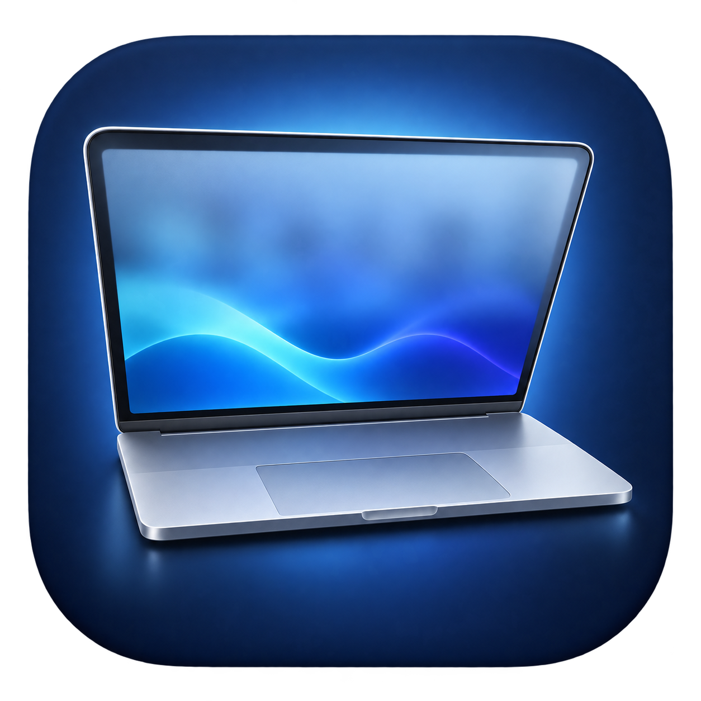

<p align="center">
  
</p>

<h1 align="center">LidGlass</h1>
<p align="center">随开合，渐入朦胧。<br />A native macOS utility for lid-angle-driven progressive blur.</p>

<p align="center">
  <a href="https://github.com/gengyu12138/LidGlass/releases">下载预览版</a> ·
  <a href="docs/SIGNING.md">签名与公证</a> ·
  <a href="https://github.com/gengyu12138/LidGlass/issues">反馈问题</a> ·
  <a href="LICENSE">MIT License</a>
</p>

## 当前状态

**v0.1.2 是未公证的实验性预览版。** 发布包采用 ad-hoc 本地签名，尚未使用 Apple Developer ID，也未通过 Apple 公证；首次启动可能受到 Gatekeeper 限制。跨机型兼容性、实际开合盖及临界角度回归仍待更多验证，请勿把构建通过视作完整功能验收。[验证范围](docs/VALIDATION.md)

## 功能

- 随屏幕开合角度改变虚化强度：顶部最强，向底部铰链逐渐变清晰。
- 合至 **88°** 进入、开至 **92°** 退出，缓冲区减少 90° 附近反复切换。
- 弱虚化阶段淡入淡出；桌面不做缩放、拉伸或位移。
- 实时角度、自动效果开关、播放预览、保持/结束预览及独立“恢复桌面”。
- 菜单栏运行，只作用于内置屏幕；不修改睡眠、锁屏或登录启动设置。

## 系统要求

| 项目 | 要求 / 已验证范围 |
| --- | --- |
| 系统 | macOS 14 或更新版本 |
| 架构 | Apple Silicon（arm64）；不提供 Intel 安装包 |
| 自动效果 | 需要兼容的屏幕开合角度传感器，不保证所有 Apple Silicon MacBook 都支持 |
| 已观察到有效读数 | MacBook Pro M1 Pro，型号 MacBookPro18,3 |
| 权限 | macOS 录屏权限，用于读取本轮桌面快照 |

不支持角度读取时，仍可在有内置屏幕和录屏权限的 Mac 上尝试手动预览。外接显示器不会覆盖虚化层。

## 下载与安装

1. 从 [Releases](https://github.com/gengyu12138/LidGlass/releases) 下载 `LidGlass-0.1.2-arm64-preview.dmg`。
2. 退出旧版，打开 DMG，将 `LidGlass.app` 拖到 **Applications**。也可以下载 ZIP，解压后移入“应用程序”。
3. 从“应用程序”启动 LidGlass。未公证版本可能被系统阻止；确认下载来源后，可按 macOS“隐私与安全性”的提示自行选择“仍要打开”，或从源码构建。无需关闭 Gatekeeper、SIP 或移除隔离属性。
4. 在控制窗口点击“录屏权限设置…”，允许 **LidGlass**，并按系统提示退出、重新打开。
5. 先打开屏幕至 90° 以上，再缓慢合盖；不必完全合上。也可点击“播放开合动画”。

发布页同时附带 `SHA256SUMS.txt`。把安装包与校验文件放在同一目录，可检查文件是否与发布内容一致：

```sh
shasum -a 256 LidGlass-0.1.2-arm64-preview.dmg
```

将输出与 `SHA256SUMS.txt` 中同名文件的值比较。SHA-256 校验不替代 Developer ID 签名或 Apple 公证。

## 使用

- **随开合盖自动虚化**：只控制角度驱动效果；关闭后仍可手动预览。应用会记住开关状态，重启后保持选择。
- **播放开合动画**：演示一次合盖增强、开盖减弱的过程。
- **保持预览 / 结束预览**：保持最强效果，方便观察顶部到底部的虚化差异。
- **恢复桌面**：立即结束当前效果；控制窗口处于键盘焦点时也可按 Esc。
- **收起到菜单栏**：隐藏控制窗口，功能继续运行。通过菜单栏笔记本图标或再次打开应用找回窗口。
- **退出**：菜单栏笔记本图标 → 退出 LidGlass。

恢复桌面后，如果屏幕还处于低角度，需要先打开到 90° 以上才能再次自动触发。应用启动时处于低角度也会等待这一步，避免突然遮挡工作画面。唤醒后也沿用此规则。

## 隐私与限制

应用每轮效果开始时通过 ScreenCaptureKit 读取一次内置屏幕快照，并用 Metal / Core Image 在本机处理。快照只在内存中存在，不保存到文件、不联网、不上传、不录音。锁屏或睡眠时结束效果并释放快照。

动画中的桌面是**静态快照**，视频或其他动态内容不会实时更新；恢复后回到真实桌面。本工具不替换 macOS 锁屏动画，不阻止系统睡眠，不支持在锁屏上显示私有桌面快照。

## 常见问题

**已允许录屏，但应用仍提示需要权限？**

完全退出并重新打开应用。若刚升级或重新编译，ad-hoc 签名变化可能导致系统保留旧版本授权记录，需要在录屏设置中更新同一个应用的授权并按提示重启。以图形应用状态为准，终端 `--status` 的权限归属可能不同。[签名说明](docs/SIGNING.md)

**90° 左右仍有抖动？**

本版已加入 88° / 92° 缓冲区及淡入淡出，但临界角度实机回归尚未完成。请反馈 Mac 型号、系统版本、读数变化、自动效果或预览是否同样出现，并避免上传包含个人桌面信息的录屏。

**如何卸载？**

退出 LidGlass，把“应用程序”中的 `LidGlass.app` 移到废纸篓；可在系统设置中移除它的录屏权限。应用不安装后台服务，也不创建自启动项。

## 从源码构建

需要 Apple Command Line Tools 或 Xcode，无第三方运行时依赖：

```sh
git clone https://github.com/gengyu12138/LidGlass.git
cd LidGlass
zsh build.sh
open build/LidGlass.app
```

构建产物在 `build/LidGlass.app`。如果缺少开发工具，可自行运行 `xcode-select --install` 完成 Apple 的安装流程。

打包与诊断：

```sh
zsh package.sh
build/LidGlass.app/Contents/MacOS/LidGlass --status
```

`package.sh` 使用已经构建的应用生成 `dist/` 下的 DMG、ZIP 和 SHA-256。`--status` 仅读取真实传感器与当前进程上下文的捕获权限，不模拟硬件、不验证动画渲染。GitHub Actions 负责构建和打包，无法验证真实笔记本的开合盖。

正式 Developer ID 签名可通过 `SIGNING_IDENTITY` 配置，具体条件和公证流程见 [SIGNING.md](docs/SIGNING.md)。默认构建仍是未公证预览版。

## 实现与参考

- Swift / AppKit 控制窗口与菜单栏。
- IOKit HID Feature Report 读取角度：Apple Vendor `0x05ac`、Usage Page `0x20`、Usage `0x8a`、Report `1`。该协议未公开，系统或硬件变化可能需要适配。
- ScreenCaptureKit 截图，Metal / Core Image 的可变半径模糊按屏幕高度生成渐变。
- 视觉参考：[Apple — Design for iPhone Duo](https://developer.apple.com/videos/play/tech-talks/111466/?time=34)。本项目不是 Apple 官方产品，参数为独立适配值。
- 传感器协议参考：[samhenrigold/LidAngleSensor](https://github.com/samhenrigold/LidAngleSensor)。本项目没有打包第三方库。
- 图标由 imagegen 生成，生成提示词保存在 [Assets/生成说明.md](Assets/生成说明.md)，随本项目以 MIT 许可证提供。

## 贡献

欢迎通过 Issue 提供兼容性与复现信息，或提交范围明确的 PR。提交前运行 `zsh build.sh`，涉及打包时再运行 `zsh package.sh`。不要提交证书、私钥、账号凭据或桌面快照；生成产物放在 Releases。

## 许可证

[MIT](LICENSE) · Copyright © 2026 gengyu12138
